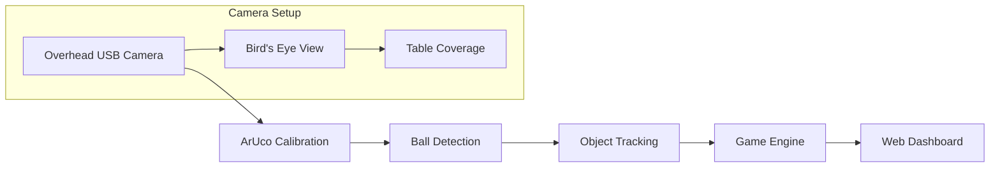

# PoolMind

Welcome to the PoolMind documentation! This project provides a complete computer vision solution for tracking pool games on Raspberry Pi with **overhead camera setup**.

> 📹 **Camera Requirement**: PoolMind is designed for **overhead camera installation** - the camera must be mounted directly above the pool table center pointing straight down for optimal bird's-eye view analysis.

## Features

- 🎥 **Real-time ball tracking** using advanced computer vision
- 🎯 **ArUco marker calibration** for precise table mapping
- 🎱 **8-ball rule engine** with automatic game state management
- 🌐 **Web dashboard** with live streaming and statistics
- 📹 **Instant replay** system with motion detection
- 🔧 **Modular architecture** for easy customization

## Hardware Requirements

### Critical: Overhead Camera Setup
- **Position**: Camera mounted **directly above the table center**
- **Height**: 2-3 meters above the surface
- **Angle**: Perfect **90° downward** angle (bird's-eye view)
- **Coverage**: Full table surface visible in frame

### Why Overhead?
- **Perspective Correction**: ArUco markers enable precise table-to-camera coordinate mapping
- **Ball Tracking**: Eliminates occlusion and perspective distortion issues
- **Game Analysis**: Accurate position tracking for rule engine
- **Calibration**: Homography transformation works best with top-down view

> ⚠️ **Important**: Side-mounted or angled cameras are not supported and will not work correctly.

## Quick Links

- [Quick Start](QUICKSTART.md) - Get started quickly
- [Configuration](CONFIGURATION.md) - Customize the system
- [Calibration](CALIBRATION.md) - Camera and marker setup
- [Web Interface](WEB.md) - Dashboard and streaming
- [Architecture](ARCHITECTURE.md) - Developer documentation
- [ArUco Markers](MARKERS.md) - Marker setup and troubleshooting

## System Overview


    E --> F[Web Dashboard]
    E --> G[Replay System]
```

## Hardware Requirements

| Component | Specification | Notes |
|-----------|---------------|-------|
| Raspberry Pi | 4B (4GB+) | ARM64 recommended |
| Camera | USB 1080p+ | Wide angle preferred |
| Display | HDMI | For real-time visualization |
| Storage | 32GB+ SD Card | Class 10 or better |
| Markers | 4x ArUco | Printable PDF included |

## Getting Started

1. **Hardware Setup**: Connect camera and display to Raspberry Pi
2. **Software Installation**: Run the automated setup script
3. **Marker Placement**: Print and position ArUco markers
4. **Calibration**: Complete the camera calibration process
5. **Play**: Start tracking your pool games!

## Project Information

- 🐛 [Report Issues](https://github.com/mrwogu/PoolMind/issues)
- 💡 [Feature Requests](https://github.com/mrwogu/PoolMind/discussions)
- 🤝 [View on GitHub](https://github.com/mrwogu/PoolMind)

## License

This project is licensed under the MIT License - see the [LICENSE](https://github.com/mrwogu/PoolMind/blob/main/LICENSE) file for details.
